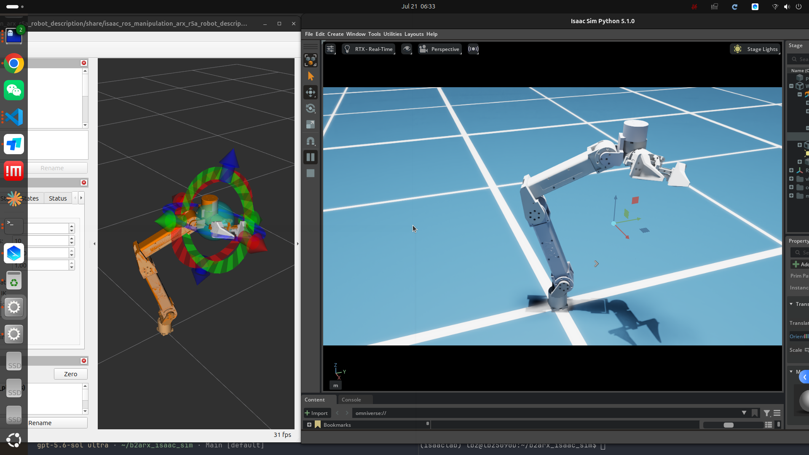
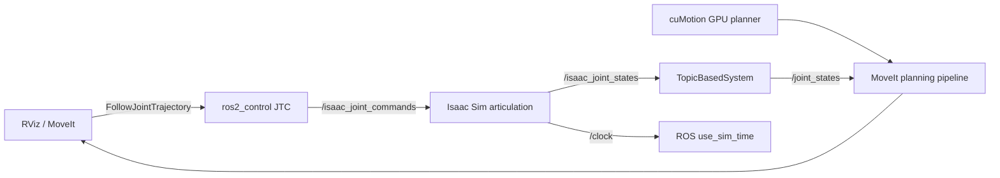

# ARX R5A cuMotion 仿真（Isaac Sim）

**新电脑迁移先看 [迁移与恢复手册](docs/migration.md)。** 最新开门示教、SkillGen
和 GR00T 数据功能在 `groot_date_generate` 分支；克隆后必须执行 `git lfs pull`。
下文原有目录示例属于早期 ROS 布局，当前迁移目录、依赖补丁和安装顺序以迁移手册为准。

[English](README.en.md) · [AprilTag 抓放 Demo](docs/apriltag-pick-place-demo.md) ·
[架构说明](docs/architecture.md) · [模型验收](docs/model-validation.md)

[](https://github.com/wee733/arx-r5-isaac-sim/actions/workflows/ci.yml)
[](LICENSE)

<p align="center">
  
</p>

*RViz 中的 cuMotion/MoveIt 规划与 Isaac Sim 5.1 中的 ARX R5A articulation 同步执行。*

这是 ARX R5A 的独立 Isaac Sim 仿真仓库。它按照 NVIDIA
[cuMotion MoveIt + Isaac Sim 4.5 教程](https://nvidia-isaac-ros.github.io/v/release-4.5/concepts/manipulation/cumotion_moveit/tutorial_isaac_sim.html)
实现从 GPU 规划到 PhysX 执行、再到 ROS 2 状态回传的完整闭环，而不只是显示 URDF。

此前的仿真运行已经完成基础控制链验证：RViz 中的 cuMotion **Plan / Execute** 成功，
机械臂 `FollowJointTrajectory` 与夹爪 `GripperCommand` action 均返回 `SUCCEEDED`；
`joint8 <- joint7` TopicBasedSystem 命令镜像、ROS 2 Bridge 和 MoveIt 状态回传均已接通。
authored USD 的相机发布、TF 和 AprilTag 感知已经验证。眼在手外入口唯一为固定在 ARX
前方的 ZED X；D455 固定在 `link6`，作为眼在手上入口。2026-07-24 已把资产中的
`/R5a` 永久设为 `(-0.4, 0.0, 0.37) m`，当前 source 真值约为
`base_link (0.741, -0.180, -0.169) m`。这个新工作位尚需重新完成 cuMotion 端到端
抓放验收；2026-07-23 的 `INVERSE_KINEMATICS_FAILURE` 属于旧根位姿下的历史结果。

## 功能概览

- Isaac Sim 5.1 固定基座 ARX R5A articulation，包含 `joint1..joint8`。
- cuMotion 负责 GPU 运动规划；RViz 路径通过 MoveIt 规划插件，官方抓放行为树直接调用 cuMotion 后再用 MoveIt 执行轨迹。
- `ros2_control` controller 管理七个独立关节 `joint1..joint7`；TopicBasedSystem 传输全部八个关节。
- Isaac Sim 发布 `/clock`、`/isaac_joint_states`，并订阅 `/isaac_joint_commands`。
- `joint8` 不是独立 controller DOF，但 TopicBasedSystem 会把 `joint7` 位置命令以
  `mimic=joint7, multiplier=1` 复制到第八个命令项，使两指都收到 drive target。
- authored USD AprilTag Demo 串联 GPU 检测、官方行为树、cuMotion 和自动抓放。
- 支持 GUI、headless、USD 导出、CPU 契约测试和可复现模型审计。

## 版本基线

| 组件 | 版本 |
|---|---|
| Ubuntu | 24.04 |
| ROS 2 | Jazzy |
| Isaac Sim | 5.1.0 / Python 3.11 |
| Isaac ROS / cuMotion | 4.5 |
| Isaac Sim Conda 环境 | `isaaclab` |
| ARX 描述版本 | `v0.3.0` / `3697451dd49e42df30055da43c959c2414c02053` |
| TopicBasedSystem | `0.3.0` / `6bd8d55e1c4ad3188770fe5c8b93b942bcede4a2` |

## 三个仓库的职责

| 仓库 | 职责 |
|---|---|
| NVIDIA `isaac_ros_manipulation` | 提供官方消息/action、对象选择、Multi-Object Pick-and-Place 行为树、cuMotion/MoveIt 集成和通用服务器。这里不维护 ARX 仿真资产。 |
| `isaac_ros_manipulation_arx_r5a` | 把官方 manipulation 工作流接到 ARX R5A，维护 ARX bringup、AprilTag object server 和实机侧适配；其模型依赖由 [`Isaac_Ros_CuMotion_ArxR5a`](https://github.com/wee733/Isaac_Ros_CuMotion_ArxR5a) 提供。 |
| 本仓库 `arx-r5-isaac-sim` | 只负责 ARX 的 Isaac Sim 场景、RGB-D 相机、ROS 2 Bridge、TopicBasedSystem 控制闭环，以及不污染实机配置的仿真专用参数。 |

URDF、SRDF、XRDF、网格和 MoveIt 配置仍来自 `Isaac_Ros_CuMotion_ArxR5a`；
官方行为树实现、标准 action 类型和 cuMotion 接口保持不变。本仓库只为桌面几何覆盖
抓取 seed 与 approach/retract 距离。

## 已验证目录布局

下面的命令按已经验证成功的布局编写：

```text
~/workspace/
├── isaac_ros_source/
│   ├── install/                         # 官方 Isaac ROS manipulation overlay
│   ├── arx-r5-isaac-sim/
│   ├── isaac_ros_manipulation_arx_r5a/ # ARX manipulation overlay
│   ├── topic_based_ros2_control/
│   └── isaac_ros_manipulation/arx-r5-moveit/
└── arx_r5_sim_ws/
    ├── build/
    ├── install/
    └── log/
```

如果源码放在其他位置，只需要修改下面对应的源码路径变量。

## 首次构建

### 1. 准备四份源码

已有这些仓库时可以跳过对应的 `git clone`。下面保留当前已验证的嵌套目录，
并将模型与 TopicBasedSystem 固定到版本表中的提交：

```bash
export ISAAC_ROS_SRC="$HOME/workspace/isaac_ros_source"
export SIM_REPO="$ISAAC_ROS_SRC/arx-r5-isaac-sim"
export ARX_MANIP_REPO="$ISAAC_ROS_SRC/isaac_ros_manipulation_arx_r5a"
export ARX_REPO="$ISAAC_ROS_SRC/isaac_ros_manipulation/arx-r5-moveit"
export TOPIC_SRC="$ISAAC_ROS_SRC/topic_based_ros2_control"

mkdir -p "$ISAAC_ROS_SRC/isaac_ros_manipulation"
[[ -d "$SIM_REPO/.git" ]] || \
  git clone https://github.com/wee733/arx-r5-isaac-sim.git "$SIM_REPO"
[[ -d "$ARX_MANIP_REPO/.git" ]] || \
  git clone https://github.com/wee733/isaac_ros_manipulation_arx_r5a.git "$ARX_MANIP_REPO"
[[ -d "$ARX_REPO/.git" ]] || \
  git clone https://github.com/wee733/Isaac_Ros_CuMotion_ArxR5a.git "$ARX_REPO"
[[ -d "$TOPIC_SRC/.git" ]] || \
  git clone https://github.com/PickNikRobotics/topic_based_ros2_control.git "$TOPIC_SRC"

git -C "$ARX_MANIP_REPO" checkout 37ccc2dfa928a1bb66da6b83934c351990734dbe
git -C "$ARX_REPO" checkout v0.3.0
git -C "$TOPIC_SRC" checkout 6bd8d55e1c4ad3188770fe5c8b93b942bcede4a2
```

### 2. 构建 ARX manipulation overlay 与仿真包

```bash
isaac-ros activate
```

进入新的 `(isaac-ros)` shell 后执行：

```bash
source /opt/ros/jazzy/setup.bash

export ISAAC_ROS_SRC="$HOME/workspace/isaac_ros_source"
export ARX_MANIP_REPO="$ISAAC_ROS_SRC/isaac_ros_manipulation_arx_r5a"
export ARX_SIM_WS="$HOME/workspace/arx_r5_sim_ws"
export TOPIC_SRC="$ISAAC_ROS_SRC/topic_based_ros2_control"
export ARX_DESC="$ISAAC_ROS_SRC/isaac_ros_manipulation/arx-r5-moveit/isaac_ros_manipulation_arx_r5a_robot_description"
export SIM_SRC="$ISAAC_ROS_SRC/arx-r5-isaac-sim/arx_r5_isaac_sim_bringup"

# 官方 Isaac ROS manipulation workspace 必须已经构建。
source "$ISAAC_ROS_SRC/install/setup.bash"

cd "$ARX_MANIP_REPO"
colcon build \
  --symlink-install \
  --packages-up-to isaac_ros_manipulation_arx_r5a_bringup
source install/setup.bash

mkdir -p "$ARX_SIM_WS"
cd "$ARX_SIM_WS"

colcon build \
  --symlink-install \
  --cmake-clean-cache \
  --allow-overriding isaac_ros_manipulation_arx_r5a_robot_description \
  --base-paths "$TOPIC_SRC" "$ARX_DESC" "$SIM_SRC" \
  --packages-up-to arx_r5_isaac_sim_bringup \
  --cmake-args -DBUILD_TESTING=OFF

source install/setup.bash
```

`-DBUILD_TESTING=OFF` 必须保留：当前 TopicBasedSystem 在启用测试时会查找可选的
`ros_testing`。`--cmake-clean-cache` 则可清除之前失败构建留下的 CMake 缓存。
`--allow-overriding` 明确使用本地固定到 `v0.3.0` 的 description，覆盖官方
Isaac ROS underlay 中可能存在的同名包。

两次构建的成功结果分别应包含：

```text
Summary: 2 packages finished
Summary: 3 packages finished
```

确认 overlay 顺序正确：

```bash
ros2 pkg prefix isaac_ros_manipulation_arx_r5a_bringup
ros2 pkg prefix topic_based_ros2_control
ros2 pkg prefix isaac_ros_manipulation_arx_r5a_robot_description
ros2 pkg prefix arx_r5_isaac_sim_bringup
```

ARX bringup 应指向 `$ARX_MANIP_REPO/install/...`，其余三个路径应指向
`$HOME/workspace/arx_r5_sim_ws/install/...`。尤其不要让
`topic_based_ros2_control` 回落到与当前 ros2_control ABI 不匹配的旧二进制包。

### 3. 安装 AprilTag demo 的正式依赖

下面这些包安装在 Jazzy/Isaac ROS 环境中，不安装到 Conda `isaaclab`：

```bash
sudo apt update
sudo apt install \
  ros-jazzy-isaac-ros-apriltag \
  ros-jazzy-isaac-ros-cumotion-object-attachment \
  ros-jazzy-py-trees \
  ros-jazzy-py-trees-ros
```

开发过程中曾用解压到 `/tmp` 的临时 ROS overlay 做依赖验证；这种目录没有稳定的
`setup.bash`，可能在重启或清理后消失，不能作为可复现运行环境。正式运行必须安装上面
的 apt 包，或以等价的源码 workspace 构建，并在全新 shell 中重新 source。

## 启动仿真

两个终端必须使用相同的 `ROS_DOMAIN_ID=25` 和
`RMW_IMPLEMENTATION=rmw_fastrtps_cpp`。先启动 Isaac Sim，再启动
cuMotion/MoveIt。

### 终端 1：Isaac Sim 5.1

使用一个全新终端，只激活 Conda `isaaclab` 并只运行 Isaac Sim。不要 source
`/opt/ros/jazzy/setup.bash`，也不要进入 `isaac-ros`。系统 Jazzy 的 Python 3.12
`rclpy` 不能进入 Isaac Sim 的 Python 3.11 进程。

如果 `~/.bashrc` 自动 source 了 ROS，`conda activate` 不会撤销这些变量；请先开一个
不读取启动文件的 shell：

```bash
bash --noprofile --norc
source /home/lbz/miniforge3/etc/profile.d/conda.sh
conda activate isaaclab
unset PYTHONPATH AMENT_PREFIX_PATH COLCON_PREFIX_PATH
unset ROS_DISTRO ROS_VERSION ROS_PYTHON_VERSION LD_LIBRARY_PATH
```

```bash
conda activate isaaclab

export ISAAC_ROS_SRC="$HOME/workspace/isaac_ros_source"
export ISAAC_SIM_PYTHON="$CONDA_PREFIX/bin/python"
export ARX_R5_DESCRIPTION_SHARE="$ISAAC_ROS_SRC/isaac_ros_manipulation/arx-r5-moveit/isaac_ros_manipulation_arx_r5a_robot_description"
export ROS_DOMAIN_ID=25
export RMW_IMPLEMENTATION=rmw_fastrtps_cpp

"$ISAAC_SIM_PYTHON" -c 'import isaacsim; print(isaacsim.__file__)'
cd "$ISAAC_ROS_SRC/arx-r5-isaac-sim"
./scripts/run_isaac_sim.sh
```

成功时会看到：

```text
[arx-r5-sim] robot prim: /R5a
[arx-r5-sim] articulation root: /R5a/root_joint
[arx-r5-sim] joints: ('joint1', ..., 'joint8')
[arx-r5-sim] ROS topics: /isaac_joint_states -> ros2_control, ros2_control -> /isaac_joint_commands
rclpy loaded
```

无界面运行：

```bash
./scripts/run_isaac_sim.sh --headless
```

### 终端 2：cuMotion + MoveIt + RViz

这个终端只运行 ROS/Isaac ROS 栈，不要激活 Conda `isaaclab`。

```bash
isaac-ros activate
```

进入 `(isaac-ros)` shell 后：

```bash
# 该项目的 Isaac ROS 源码 workspace；不要继承其他项目（例如 ZED）的值。
export ISAAC_ROS_WS="$HOME/workspace/isaac_ros_source"
source /opt/ros/jazzy/setup.bash
source "$HOME/workspace/arx_r5_sim_ws/install/setup.bash"

export ROS_DOMAIN_ID=25
export RMW_IMPLEMENTATION=rmw_fastrtps_cpp

ros2 launch arx_r5_isaac_sim_bringup \
  arx_r5a_isaac_sim.launch.py \
  start_cumotion:=True \
  start_rviz:=True
```

等待以下节点和控制器就绪：

```text
Configured and activated joint_state_broadcaster
Configured and activated manipulator_controller
Configured and activated gripper_controller
You can start planning now!
```

## 在 RViz 中规划

在 MotionPlanning 面板中选择：

- Planning Group：`manipulator`
- Planning Pipeline：`isaac_ros_cumotion`
- Planner ID：`cuMotion`

拖动末端交互标记设置目标，然后依次点击 **Plan** 和 **Execute**。Isaac Sim
中的 R5A 应平滑执行同一条轨迹。

## 双相机 authored USD manipulation Demo

提交的 `assets/scenes/arx_sim.usd` 支持两条互斥的感知入口，但后半段完全共用
Isaac ROS manipulation、官方 Multi-Object Pick-and-Place 行为树、cuMotion、MoveIt
和 ros2_control：

该 LFS 资产是当前工作的 authored USD（SHA-256
`864be889853dd6829d3100352599b31a1fdb55ec41d7172d871dcf0511ebbcbc`）。其中 `/R5a`
根平移已永久保存为 `[-0.4, 0.0, 0.37]`；ZED X 相对 `base_link` 的 mount 平移仍为
`[0.28, 0.0, -0.02]`。程序运行时把文件作为只读源层，临时物理补丁进入匿名 session
layer。

| 模式 | 安装关系 | 图像 | rectified 中间话题 | cuAprilTag raw | manipulation 输入 |
|---|---|---|---|---|---|
| ZED X eye-to-hand | 固定在 authored `base_link`（位于 ARX 前方） | `/zed_x/left/image_raw` | `/zed_x/apriltag/image_rect`、`/zed_x/apriltag/camera_info_rect` | `/zed_x/tag_detections_raw` | `/zed_x/tag_detections` |
| D455 eye-in-hand | 固定在随关节运动的 `link6` | `/d455/color/image_raw` | `/d455/apriltag/image_rect`、`/d455/apriltag/camera_info_rect` | `/d455/tag_detections_raw` | `/d455/tag_detections` |

ZED X 的位置和朝向完全来自你在 Isaac Sim 中设计并保存的 USD；它位于 ARX
前方。当前根位姿已经永久写入资产，程序运行时不会再搬动相机、旋转机械臂或覆盖
`/R5a` 根位姿。

两种模式的检测器都是官方
`nvidia::isaac_ros::apriltag::AprilTagNode`，后端为 CUDA/cuAprilTag。其原始 ID、
corner 和 pose 保留在各自的 `*_raw` 话题。小像素平面标签容易出现 PnP 二义性，因此
仿真侧 pose refiner 用官方 corners、rectified CameraInfo 和 OpenCV IPPE_SQUARE 重新
求 pose。它按原始时间戳精确配对 rectified 图像，只转换四角附近的小 ROI 并做
`cornerSubPix`，同时保持 ID、corner、frame 和原始时间戳；结果发布到不带 `_raw` 的
manipulation 话题。缺少同时间戳图像、图像无效、求解失败或重投影误差超过 `2 px`
的 detection 会从 refined 流丢弃，绝不会混入 native pose；官方原始结果始终完整保留
在 `*_raw` 供诊断。
后续 ARX object adapter 再按该原始图像时间戳把 pose 转换到 `base_link`。
启动时从 USD 层级变换计算 `world -> base_link` 和相机外参，并与
`config/arx_sim_usd_scene.yaml` 中的 authored contract 校验；ROS launch 不再叠加任何
手写的相机角度或位姿。

两个仿真 wrapper 都直接使用资产中永久保存的 `/R5a = [-0.4, 0.0, 0.37]`，不再提供
运行时根节点位姿覆盖或另一套 front-demo 布局。ZED、D455、物体、目标和其他用户设计的
环境保持 USD 中的 authored 关系。运行时只在匿名 USD session layer 中添加必要的物理、
材质、碰撞和相机投影属性；这些修改不会写回 `assets/scenes/arx_sim.usd`。相机 vertical
aperture 也只在 session layer 中按实际输出宽高归一化，以保持 CameraInfo 与渲染图像
一致。

authored 模式会把桌面和四条桌腿作为五个静态碰撞对象交给官方 cuMotion
Static Planning Scene Server。由于 Isaac ROS 4.5 的 `.scene` 解析器把对象 header
固定写成 `world`，原始消息先发布到 `/cumotion/static_planning_scene_raw`，随后 ARX
frame adapter 将这些本来就以 `base_link` 数值编写的对象规范到 canonical
`/planning_scene`。MoveIt 和行为树只消费后者。

投放目标不是硬编码的世界位姿。目标客户端在每条 tag 1 检测自己的时间戳上取得相机
TF，再应用 tag-relative `link6_offset_in_tag: [0, 0, -0.315]`。其中 `205 mm` 是顶抓时
`link6` 到红块中心的距离，`75 mm` 是红块半高，余下 `35 mm` 是检测平面上方的投放
净空。诊断链为：`-0.280 m` 只有 `0 mm`，`-0.295 m` 有 `15 mm` 但仍失败，当前
`-0.315 m` 有 `35 mm`，并通过了此前的局部碰撞裕量诊断；这不等于当前永久根位姿已经
完成整条抓放流程。工程预算显式包含 Object Attachment
`max_overshoot=10 mm`、XRDF attached-object buffer `2 mm`、PnP 深度误差预算
`10 mm` 和安全余量 `5 mm`，合计 `27 mm`，还保留 `8 mm`。较低目标即使纯运动学
IK 可解，也可能因附着碰撞体进入静态桌面而由 cuMotion 返回
`INVERSE_KINEMATICS_FAILURE`。

tag 1 投放目标必须连续得到 `5` 个 exact-time、已转换到 `base_link` 的样本；客户端
对三轴分别取中值，并要求整个窗口的最大两点欧氏距离不超过 `10 mm`，所以 `20 mm`
深度摆动会被拒绝。目标丢失或仿真时钟回退会清空窗口。`drop_pose_ttl_sec` 默认
`0.5 s`，`drop_pose_max_translation_spread_m` 默认 `0.01 m`；object server 的缓存
TTL 为 `2.0 s`。

官方行为树会持续调用 `/get_objects`。为避免成功投放后又发现同一红块并启动第二轮，
authored 配置只在 `base_link` 的 source-zone
`[0.65, -0.30, -0.25] .. [0.85, -0.08, -0.10] m` 内允许 discovery。这个门控只作用于
`/get_objects`，不会改变当前任务使用的 `/get_object_pose` 缓存与 freshness 语义。

### ZED X：固定眼在手外

ZED 左目在世界中的位置和朝向就是 authored USD 中的位置；`base_link ->
zed_x_left_camera_optical_frame` 由 USD 层级变换计算并固定发布。仿真入口不会再创建
其他眼在手外视角，也不会修改你的机器人根节点或相机 mount。

终端 1 使用干净的 Conda `isaaclab` 环境：

```bash
conda activate isaaclab
export ROS_DOMAIN_ID=25
export RMW_IMPLEMENTATION=rmw_fastrtps_cpp
cd "$HOME/workspace/isaac_ros_source/arx-r5-isaac-sim"
./scripts/run_zedx_sim.sh
```

终端 2 进入 `(isaac-ros)` shell，第一次先禁止自动运动：

```bash
export ROS_DOMAIN_ID=25
export RMW_IMPLEMENTATION=rmw_fastrtps_cpp
cd "$HOME/workspace/isaac_ros_source/arx-r5-isaac-sim"
./scripts/run_zedx_demo.sh auto_start:=False
```

只读验收：

```bash
./scripts/check_ros_graph.sh --zedx
```

authored USD 已验证 ZED X 图像、CameraInfo、TF 和官方 CUDA cuAprilTag 感知；ZED
相机保持在 ARX 前方。永久移动后的 source 真值为
`base_link ≈ (0.741, -0.180, -0.169) m`，需要重新运行 cuMotion、接触、attach、搬运和
投放验收。旧 `base_link ≈ (0.892, -0.180, -0.173) m` 根位姿曾在 2026-07-23 返回
`INVERSE_KINEMATICS_FAILURE`，不能代表当前资产的可达性。

### D455：腕部眼在手上

先停止上一套 Isaac Sim，确保只有一个 `/clock` publisher。终端 1：

```bash
conda activate isaaclab
export ROS_DOMAIN_ID=25
export RMW_IMPLEMENTATION=rmw_fastrtps_cpp
cd "$HOME/workspace/isaac_ros_source/arx-r5-isaac-sim"
./scripts/run_d455_sim.sh
```

终端 2 的 `(isaac-ros)` shell：

```bash
export ROS_DOMAIN_ID=25
export RMW_IMPLEMENTATION=rmw_fastrtps_cpp
cd "$HOME/workspace/isaac_ros_source/arx-r5-isaac-sim"
./scripts/run_d455_demo.sh auto_start:=False
```

`run_d455_sim.sh` 会把机械臂初始化到一个保留的 D455 启动关节位
`[-1.3919817209, 1.8859872818, 0.5746622086, -0.6957563162, -0.6273930669, -1.9993159771, 0.044, 0.044]`，
依次对应 `joint1..joint8`。它只用于让 Isaac Sim 与 ros2_control 以一致初值启动。
这个关节 seed 尚未在新的永久根位姿上重新完成端到端验收；旧根位姿下的
`INVERSE_KINEMATICS_FAILURE` 不能直接沿用为当前结论。
ros2_control hardware 使用全部八个初值；
`joint8` 初值等于 `joint7`，后续也由 TopicBasedSystem 复制 `joint7` 命令，不会被
controller 作为第二个夹爪自由度单独控制。
`link6 -> d455_color_optical_frame` 是固定安装边，而
`base_link -> link6` 随 `/joint_states` 变化。源物体和目标 Tag 都会按每条检测消息的
原始时间戳异步等待 exact-time TF，绝不把旧图像配上 latest 腕部姿态。

这里的“逐帧动态 TF”是 timestamp-correct 感知，不是 continuous visual servo。
adapter 会过滤并缓存稳定的 `base_link` 目标；行为树开始后，cuMotion 使用该目标完成
一次规划与执行，不会在机械臂运动期间随每一帧图像持续重规划。

只读验收：

```bash
./scripts/check_ros_graph.sh --d455
```

确认检测、TF、controller 和规划服务均正常后，去掉 `auto_start:=False` 即可自动发送
一次抓放任务。不要把 ZED 的 Isaac Sim 命令与 D455 的 ROS 脚本混用，也不要同时启动
两套 ROS manipulation graph。

authored demo 默认设置 `quiesce_on_terminal:=True`：官方 action 返回终态后，只暂停
行为树的定时 tick，action server 和 executor 会继续存活，确保最终 result 已送达，同时
避免成功后以 100 Hz 重复 discovery 并刷空检测日志。需要保留官方连续 tick 行为时可显式
设置 `quiesce_on_terminal:=False`；再次执行 one-shot 任务则重启 ROS demo。

## 验证运行状态

`check_ros_graph.sh` 是只读健康检查，不会移动机器人。它验证话题类型、控制
action 和三个 controller 是否为 `active`：

```bash
export ROS_DOMAIN_ID=25
export RMW_IMPLEMENTATION=rmw_fastrtps_cpp
"$HOME/workspace/isaac_ros_source/arx-r5-isaac-sim/scripts/check_ros_graph.sh"
```

正常输出末尾为：

```text
ARX R5A Isaac Sim ROS graph contract is present.
```

其他常用检查：

```bash
ros2 topic hz /isaac_joint_states
ros2 topic hz /isaac_joint_commands
ros2 topic echo /isaac_joint_states --once
```

`/isaac_joint_states` 应持续发布；`/isaac_joint_commands` 通常只在轨迹执行期间有
流量，因此尚未点击 **Execute** 时，第二条 `ros2 topic hz` 没有输出并不代表故障。

## 常见提示

| 日志或现象 | 含义 / 处理方式 |
|---|---|
| `listing git files failed - pretending there aren't any` | 外部 `--base-paths` 下的 setuptools 文件枚举提示；只要包最终 `Finished` 即可。 |
| `TopicBasedSystem::on_init ... deprecated` | 上游 TopicBasedSystem 针对新 Jazzy hardware interface 的编译警告，不影响运行。 |
| 找不到 `ros_testing` | 构建命令没有正确收到 `-DBUILD_TESTING=OFF`；复制完整命令重新构建，避免在路径中间换行。 |
| `PYTHONPATH contains Python 3.12` | Isaac Sim 终端被 ROS 环境污染；重新打开终端，只激活 `conda isaaclab`。如果 `~/.bashrc` 自动 source `/opt/ros/jazzy/setup.bash`，请把它移到 ROS 终端手动执行；不要在 Isaac Sim 终端 source ROS。 |
| `LD_LIBRARY_PATH contains a ROS installation` | Isaac Sim 终端继承了 ROS 动态库路径；在干净的 Isaac Sim shell 中执行 `unset LD_LIBRARY_PATH`，再启动场景。 |
| `No 3D sensor plugin(s) defined for octomap updates` | 当前未启用 Nvblox/ESDF，属于预期提示。 |
| controller 卡在 `Initialize hardware` | 检查 `ros2 pkg prefix topic_based_ros2_control` 是否指向本地 workspace install，并最后 source 仿真 overlay。 |
| `No module named 'isaac_ros_test'`，随后 RViz 报 `context is not valid` 并以 `-6` 退出 | 首发错误是 Isaac ROS Python overlay 路径错误，RViz 只是被 launch 连带关闭。执行 `export ISAAC_ROS_WS="$HOME/workspace/isaac_ros_source"`；脚本也会自动忽略不包含 `isaac_ros_common/isaac_ros_test` 的无关 workspace。 |

## 执行链路



`joint1..joint6` 属于 `manipulator`；`joint7` 是主动夹爪 controller 关节；`joint8`
不是第二个独立 controller 自由度，但它存在于 TopicBasedSystem hardware block 中。
因此 `/isaac_joint_commands` 的 name/position 都有八项，最后一项由插件镜像 `joint7`。

## 仓库结构

```text
arx-r5-isaac-sim/
├── arx_r5_isaac_sim_bringup/
│   ├── arx_r5_isaac_sim_bringup/  # Isaac Sim standalone 与接口契约
│   ├── launch/                    # cuMotion/MoveIt/ros2_control bringup
│   ├── urdf/                      # 仿真专用 TopicBasedSystem xacro
│   ├── config/                    # controller 与初始姿态
│   └── test/                      # 不启动 GPU 的契约测试
├── pictures/                      # GitHub 项目介绍图
├── scripts/                       # 启动、健康检查与模型审计
├── docs/                          # 架构和模型验收说明
└── dependencies.repos             # 固定外部依赖版本
```

## 开发与离线验证

CPU 契约测试不需要 Isaac Sim：

```bash
python -m pip install -e ./arx_r5_isaac_sim_bringup
python -m pytest -q arx_r5_isaac_sim_bringup/test/test_contract.py
```

导出可检查的 USD：

```bash
./scripts/run_isaac_sim.sh \
  --headless --no-ros --exit-after-build \
  --save-usd generated/arx_r5a_scene.usda
```

USD 是生成物，默认不提交。仓库已为 `.usd`、`.usda`、`.usdc`、`.usdz` 和 STL
配置 Git LFS。

模型 FK 和 XRDF sphere/mesh 审计见
[模型验收说明](docs/model-validation.md)；脚本支持文本或 JSON 输出：

```bash
./scripts/audit_model.py \
  --description-share /path/to/isaac_ros_manipulation_arx_r5a_robot_description \
  --vendor-urdf /path/to/X5liteaa0.urdf \
  --output json
```

## 当前边界

- 当前包含固定基座执行闭环，以及 authored USD 中两条互斥的相机入口：固定在
  `base_link` 前方的 ZED X eye-to-hand 和固定在 `link6` 的 D455 eye-in-hand。眼在手外
  不再提供其他模拟相机视角。
- authored 双相机模式已通过静态 `.scene` 把桌面和四条桌腿共五个对象加入
  `/planning_scene`。`read_esdf_world=False` 且 `add_ground_plane=False`，因此仍没有
  Nvblox 动态 ESDF、独立 ground plane 或其他可见场景障碍物。
- AprilTag 替代了 SAM/FoundationPose 感知前端；对象选择、行为树 action、cuMotion、
  MoveIt 和 ros2_control 接口链保持一致。
- authored tag 0 的物体位姿来自官方 cuAprilTag corners 的有界 IPPE refinement、
  exact-time TF 和已配置的 tag-to-object 固定变换；官方原始结果保留在 `*_raw`。
  tag 1 由目标客户端用同一时刻的相机 TF 和 tag-relative 末端偏移转换为投放 pose；
  `35 mm` 投放净空也沿检测到的 tag 法向定义，不是硬编码的世界投放点。它们是仿真
  姿态/任务适配，不是新的标签检测器。
- authored USD 红块先以带碰撞的 kinematic 刚体等待。`joint7` 的 linear drive 使用有限
  最大力，默认 `8 N`，可通过 `--gripper-drive-max-force` 调整。TopicBasedSystem 同时
  向 `joint7` 和 `joint8` 发送相同位置目标，避免受力时只靠 PhysX mimic 导致双指状态
  分离；`joint8` 仍不属于独立 controller。
- 只有夹爪开度和 `grasp_frame` 距离都满足阈值，并且红块与 `link7`、`link8` 的双侧
  PhysX 接触连续保持若干物理步后，红块才转为 dynamic 并创建连接 `link6` 的
  FixedJoint。默认要求连续 `3` 步，可通过 `--grasp-contact-steps` 调整；张开夹爪会删除
  joint。FixedJoint 只用于稳定搬运，这仍不是纯靠接触力与摩擦自然形成的夹持。
  cuMotion Object Attachment 另行维护规划场景中的 attached object。
- D455 按每帧图像时间戳查询动态 TF，但当前流程不是 continuous visual servo。
- ZED X 与 D455 authored 模式已验证相机、TF 和 AprilTag 感知。当前永久根位姿下的
  source 为 `base_link ≈ (0.741, -0.180, -0.169) m`，尚需重新完成端到端抓放；
  2026-07-23 的 `INVERSE_KINEMATICS_FAILURE` 是旧根位姿的历史结果。
- Nvblox/ESDF 与经标定的接触抓取仍属于下一阶段。
- 当前 ARX 模型仍需完成真实 TCP、相机外参、碰撞几何、整机标定和急停验收；仿真
  成功不能保证实机必然成功。

本项目是社区集成，并非 ARX Robotics 或 NVIDIA 官方发布。

## 许可证

原创集成代码使用 Apache-2.0；从 ARX 配置改写的文件使用 BSD-3-Clause，派生的
NVIDIA/MoveIt launch 文件保留上游声明。详见 [NOTICE](NOTICE.md) 和
[`LICENSES/BSD-3-Clause.txt`](LICENSES/BSD-3-Clause.txt)。
