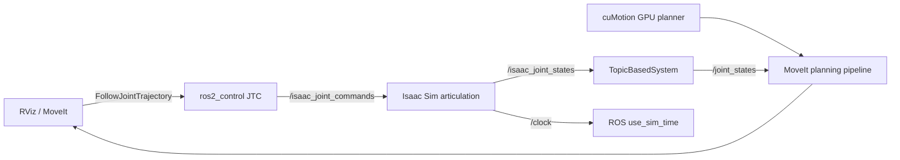

# ARX R5A cuMotion 仿真（Isaac Sim）

[English](README.en.md) · [架构说明](docs/architecture.md) · [模型验收](docs/model-validation.md)

[](https://github.com/wee733/arx-r5-isaac-sim/actions/workflows/ci.yml)
[](LICENSE)

<p align="center">
  
</p>

*RViz 中的 cuMotion/MoveIt 规划与 Isaac Sim 5.1 中的 ARX R5A articulation 同步执行。*

这是 ARX R5A 的独立 Isaac Sim 仿真仓库。它按照 NVIDIA
[cuMotion MoveIt + Isaac Sim 4.5 教程](https://nvidia-isaac-ros.github.io/v/release-4.5/concepts/manipulation/cumotion_moveit/tutorial_isaac_sim.html)
实现从 GPU 规划到 PhysX 执行、再到 ROS 2 状态回传的完整闭环，而不只是显示 URDF。

当前版本已经完成仿真端到端验证：RViz 中的 cuMotion **Plan / Execute** 成功，
机械臂 `FollowJointTrajectory` 与夹爪 `GripperCommand` action 均返回 `SUCCEEDED`；
`joint8 <- joint7` PhysX mimic、ROS 2 Bridge 和 MoveIt 状态回传均正常工作。

## 功能概览

- Isaac Sim 5.1 固定基座 ARX R5A articulation，包含 `joint1..joint8`。
- cuMotion 负责 GPU 运动规划，MoveIt 负责规划接口和轨迹执行。
- `ros2_control` 的 TopicBasedSystem 管理七个独立关节 `joint1..joint7`。
- Isaac Sim 发布 `/clock`、`/isaac_joint_states`，并订阅 `/isaac_joint_commands`。
- `joint8` 不进入命令通道，只由 PhysX mimic `joint7`。
- 支持 GUI、headless、USD 导出、CPU 契约测试和可复现模型审计。

## 版本基线

| 组件 | 版本 |
|---|---|
| Ubuntu | 24.04 |
| ROS 2 | Jazzy |
| Isaac Sim | 5.1.0 / Python 3.11 |
| Isaac ROS / cuMotion | 4.5 |
| Isaac Sim Conda 环境 | `isaaclab` |
| ARX 描述提交 | `c85c2c7c84bb630f30f87904bebebbd83dddd2db` |
| TopicBasedSystem | `0.3.0` / `6bd8d55e1c4ad3188770fe5c8b93b942bcede4a2` |

机器人几何、SRDF、XRDF 和 MoveIt 配置继续由
[`Isaac_Ros_CuMotion_ArxR5a`](https://github.com/wee733/Isaac_Ros_CuMotion_ArxR5a)
维护，本仓库只维护 Isaac Sim 场景、ROS 桥接和仿真专用控制配置。

## 已验证目录布局

下面的命令按已经验证成功的布局编写：

```text
~/workspace/
├── isaac_ros_source/
│   ├── arx-r5-isaac-sim/
│   ├── topic_based_ros2_control/
│   └── isaac_ros_manipulation/arx-r5-moveit/
└── arx_r5_sim_ws/
    ├── build/
    ├── install/
    └── log/
```

如果源码放在其他位置，只需要修改下面三个 `*_SRC`/`ARX_DESC` 变量。

## 首次构建

### 1. 准备三份源码

已有这些仓库时可以跳过对应的 `git clone`。下面保留当前已验证的嵌套目录，
并将模型与 TopicBasedSystem 固定到版本表中的提交：

```bash
export ISAAC_ROS_SRC="$HOME/workspace/isaac_ros_source"
export SIM_REPO="$ISAAC_ROS_SRC/arx-r5-isaac-sim"
export ARX_REPO="$ISAAC_ROS_SRC/isaac_ros_manipulation/arx-r5-moveit"
export TOPIC_SRC="$ISAAC_ROS_SRC/topic_based_ros2_control"

mkdir -p "$ISAAC_ROS_SRC/isaac_ros_manipulation"
[[ -d "$SIM_REPO/.git" ]] || \
  git clone https://github.com/wee733/arx-r5-isaac-sim.git "$SIM_REPO"
[[ -d "$ARX_REPO/.git" ]] || \
  git clone https://github.com/wee733/Isaac_Ros_CuMotion_ArxR5a.git "$ARX_REPO"
[[ -d "$TOPIC_SRC/.git" ]] || \
  git clone https://github.com/PickNikRobotics/topic_based_ros2_control.git "$TOPIC_SRC"

git -C "$ARX_REPO" checkout c85c2c7c84bb630f30f87904bebebbd83dddd2db
git -C "$TOPIC_SRC" checkout 6bd8d55e1c4ad3188770fe5c8b93b942bcede4a2
```

### 2. 进入 Isaac ROS 环境

```bash
isaac-ros activate
```

进入新的 `(isaac-ros)` shell 后执行：

```bash
source /opt/ros/jazzy/setup.bash

export ISAAC_ROS_SRC="$HOME/workspace/isaac_ros_source"
export ARX_SIM_WS="$HOME/workspace/arx_r5_sim_ws"
export TOPIC_SRC="$ISAAC_ROS_SRC/topic_based_ros2_control"
export ARX_DESC="$ISAAC_ROS_SRC/isaac_ros_manipulation/arx-r5-moveit/isaac_ros_manipulation_arx_r5a_robot_description"
export SIM_SRC="$ISAAC_ROS_SRC/arx-r5-isaac-sim/arx_r5_isaac_sim_bringup"

mkdir -p "$ARX_SIM_WS"
cd "$ARX_SIM_WS"

colcon build \
  --symlink-install \
  --cmake-clean-cache \
  --base-paths "$TOPIC_SRC" "$ARX_DESC" "$SIM_SRC" \
  --packages-up-to arx_r5_isaac_sim_bringup \
  --cmake-args -DBUILD_TESTING=OFF

source install/setup.bash
```

`-DBUILD_TESTING=OFF` 必须保留：当前 TopicBasedSystem 在启用测试时会查找可选的
`ros_testing`。`--cmake-clean-cache` 则可清除之前失败构建留下的 CMake 缓存。

成功结果应为：

```text
Summary: 3 packages finished
```

确认 overlay 顺序正确：

```bash
ros2 pkg prefix topic_based_ros2_control
ros2 pkg prefix isaac_ros_manipulation_arx_r5a_robot_description
ros2 pkg prefix arx_r5_isaac_sim_bringup
```

三个路径都应指向 `$HOME/workspace/arx_r5_sim_ws/install/...`。尤其不要让
`topic_based_ros2_control` 回落到与当前 ros2_control ABI 不匹配的旧二进制包。

## 启动仿真

两个终端必须使用相同的 `ROS_DOMAIN_ID` 和 RMW。先启动 Isaac Sim，再启动
cuMotion/MoveIt。

### 终端 1：Isaac Sim 5.1

使用一个全新终端，不要 source `/opt/ros/jazzy/setup.bash`，也不要进入
`isaac-ros`。系统 Jazzy 的 Python 3.12 `rclpy` 不能进入 Isaac Sim 的 Python
3.11 进程。

```bash
conda activate isaaclab

export ISAAC_ROS_SRC="$HOME/workspace/isaac_ros_source"
export ISAAC_SIM_PYTHON="$CONDA_PREFIX/bin/python"
export ARX_R5_DESCRIPTION_SHARE="$ISAAC_ROS_SRC/isaac_ros_manipulation/arx-r5-moveit/isaac_ros_manipulation_arx_r5a_robot_description"
export ROS_DOMAIN_ID=23
export RMW_IMPLEMENTATION=rmw_fastrtps_cpp

"$ISAAC_SIM_PYTHON" -c 'import isaacsim; print(isaacsim.__file__)'
cd "$ISAAC_ROS_SRC/arx-r5-isaac-sim"
./scripts/run_isaac_sim.sh
```

成功时会看到：

```text
[arx-r5-sim] robot prim: /R5a
[arx-r5-sim] articulation root: /R5a/root_joint
[arx-r5-sim] joints: ('joint1', ..., 'joint8')
[arx-r5-sim] ROS topics: /isaac_joint_states -> ros2_control, ros2_control -> /isaac_joint_commands
rclpy loaded
```

无界面运行：

```bash
./scripts/run_isaac_sim.sh --headless
```

### 终端 2：cuMotion + MoveIt + RViz

```bash
isaac-ros activate
```

进入 `(isaac-ros)` shell 后：

```bash
source /opt/ros/jazzy/setup.bash
source "$HOME/workspace/arx_r5_sim_ws/install/setup.bash"

export ROS_DOMAIN_ID=23
export RMW_IMPLEMENTATION=rmw_fastrtps_cpp

ros2 launch arx_r5_isaac_sim_bringup \
  arx_r5a_isaac_sim.launch.py \
  start_cumotion:=True \
  start_rviz:=True
```

等待以下节点和控制器就绪：

```text
Configured and activated joint_state_broadcaster
Configured and activated manipulator_controller
Configured and activated gripper_controller
You can start planning now!
```

## 在 RViz 中规划

在 MotionPlanning 面板中选择：

- Planning Group：`manipulator`
- Planning Pipeline：`isaac_ros_cumotion`
- Planner ID：`cuMotion`

拖动末端交互标记设置目标，然后依次点击 **Plan** 和 **Execute**。Isaac Sim
中的 R5A 应平滑执行同一条轨迹。

## 验证运行状态

`check_ros_graph.sh` 是只读健康检查，不会移动机器人。它验证话题类型、控制
action 和三个 controller 是否为 `active`：

```bash
export ROS_DOMAIN_ID=23
"$HOME/workspace/isaac_ros_source/arx-r5-isaac-sim/scripts/check_ros_graph.sh"
```

正常输出末尾为：

```text
ARX R5A Isaac Sim ROS graph contract is present.
```

其他常用检查：

```bash
ros2 topic hz /isaac_joint_states
ros2 topic hz /isaac_joint_commands
ros2 topic echo /isaac_joint_states --once
```

`/isaac_joint_states` 应持续发布；`/isaac_joint_commands` 通常只在轨迹执行期间有
流量，因此尚未点击 **Execute** 时，第二条 `ros2 topic hz` 没有输出并不代表故障。

## 常见提示

| 日志或现象 | 含义 / 处理方式 |
|---|---|
| `listing git files failed - pretending there aren't any` | 外部 `--base-paths` 下的 setuptools 文件枚举提示；只要包最终 `Finished` 即可。 |
| `TopicBasedSystem::on_init ... deprecated` | 上游 TopicBasedSystem 针对新 Jazzy hardware interface 的编译警告，不影响运行。 |
| 找不到 `ros_testing` | 构建命令没有正确收到 `-DBUILD_TESTING=OFF`；复制完整命令重新构建，避免在路径中间换行。 |
| `PYTHONPATH contains Python 3.12` | Isaac Sim 终端被 ROS 环境污染；重新打开终端，只激活 `conda isaaclab`。 |
| `No 3D sensor plugin(s) defined for octomap updates` | 当前未启用 Nvblox/ESDF，属于预期提示。 |
| controller 卡在 `Initialize hardware` | 检查 `ros2 pkg prefix topic_based_ros2_control` 是否指向本地 workspace install，并最后 source 仿真 overlay。 |

## 执行链路



`joint1..joint6` 属于 `manipulator`；`joint7` 是主动夹爪关节；`joint8` 只存在于
URDF/PhysX mimic 关系中，不会被作为第二个独立命令关节。

## 仓库结构

```text
arx-r5-isaac-sim/
├── arx_r5_isaac_sim_bringup/
│   ├── arx_r5_isaac_sim_bringup/  # Isaac Sim standalone 与接口契约
│   ├── launch/                    # cuMotion/MoveIt/ros2_control bringup
│   ├── urdf/                      # 仿真专用 TopicBasedSystem xacro
│   ├── config/                    # controller 与初始姿态
│   └── test/                      # 不启动 GPU 的契约测试
├── pictures/                      # GitHub 项目介绍图
├── scripts/                       # 启动、健康检查与模型审计
├── docs/                          # 架构和模型验收说明
└── dependencies.repos             # 固定外部依赖版本
```

## 开发与离线验证

CPU 契约测试不需要 Isaac Sim：

```bash
python -m pip install -e ./arx_r5_isaac_sim_bringup
python -m pytest -q arx_r5_isaac_sim_bringup/test/test_contract.py
```

导出可检查的 USD：

```bash
./scripts/run_isaac_sim.sh \
  --headless --no-ros --exit-after-build \
  --save-usd generated/arx_r5a_scene.usda
```

USD 是生成物，默认不提交。仓库已为 `.usd`、`.usda`、`.usdc`、`.usdz` 和 STL
配置 Git LFS。

模型 FK 和 XRDF sphere/mesh 审计见
[模型验收说明](docs/model-validation.md)；脚本支持文本或 JSON 输出：

```bash
./scripts/audit_model.py \
  --description-share /path/to/isaac_ros_manipulation_arx_r5a_robot_description \
  --vendor-urdf /path/to/X5liteaa0.urdf \
  --output json
```

## 当前边界

- 当前是固定基座、关节状态/命令、时钟和 cuMotion 执行闭环。
- `read_esdf_world=False` 且 `add_ground_plane=False`；Isaac Sim 中可见的地面和
  障碍物尚未进入 cuMotion 规划世界。
- 相机、Nvblox ESDF、目标检测和抓取场景属于下一阶段。
- 当前 ARX 模型仍需完成真实 TCP、碰撞几何和整机标定验收。

本项目是社区集成，并非 ARX Robotics 或 NVIDIA 官方发布。

## 许可证

原创集成代码使用 Apache-2.0；从 ARX 配置改写的文件使用 BSD-3-Clause，派生的
NVIDIA/MoveIt launch 文件保留上游声明。详见 [NOTICE](NOTICE.md) 和
[`LICENSES/BSD-3-Clause.txt`](LICENSES/BSD-3-Clause.txt)。
