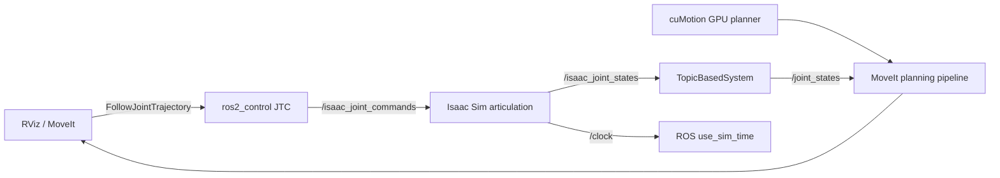

# ARX R5A cuMotion 仿真（Isaac Sim）

[English](README.en.md)

这是 ARX R5A 的独立 Isaac Sim 仿真仓库。它按照 NVIDIA 的
[cuMotion MoveIt + Isaac Sim 4.5 教程](https://nvidia-isaac-ros.github.io/v/release-4.5/concepts/manipulation/cumotion_moveit/tutorial_isaac_sim.html)
实现完整执行闭环，而不是只把 URDF 显示在 Isaac Sim 中。

已对齐的版本基线：

- Ubuntu 24.04、ROS 2 Jazzy
- Isaac Sim 5.1.0
- Isaac ROS 4.5、cuMotion 4.5
- ARX R5A MoveIt/cuMotion 描述提交 `c85c2c7`

本仓库不复制 ARX 网格或 NVIDIA 资产。机器人几何、SRDF、XRDF 和 MoveIt
配置继续来自
[`Isaac_Ros_CuMotion_ArxR5a`](https://github.com/wee733/Isaac_Ros_CuMotion_ArxR5a)，
仿真仓库只维护 Isaac Sim 场景、ROS 桥接和仿真专用控制配置。

## 执行链路



`joint1..joint6` 属于 `manipulator` 规划组；`joint7` 是主动夹爪关节；
`joint8` 在 URDF/PhysX 中 mimic `joint7`，不会被作为第二个独立命令关节。

## 仓库结构

```text
arx-r5-isaac-sim/
├── arx_r5_isaac_sim_bringup/
│   ├── arx_r5_isaac_sim_bringup/  # Isaac Sim standalone 与接口契约
│   ├── launch/                    # MoveIt/cuMotion/ros2_control bringup
│   ├── urdf/                      # 仿真专用 TopicBasedSystem xacro
│   ├── config/                    # controller 与初始姿态
│   └── test/                      # 不启动 GPU 的契约测试
├── scripts/                       # 启动与 ROS 图检查
├── docs/                          # 架构和模型验收说明
└── dependencies.repos             # 固定 ARX 描述版本
```

## 安装与编译

把本仓库放在 Isaac ROS 工作区的 `src/` 下，并导入固定版本的 ARX 描述和
TopicBasedSystem 源码依赖：

```bash
cd ${ISAAC_ROS_WS}/src
git clone https://github.com/wee733/arx-r5-isaac-sim.git
vcs import . < arx-r5-isaac-sim/dependencies.repos
```

进入 Isaac ROS 4.5 环境后安装依赖并编译：

```bash
cd ${ISAAC_ROS_WS}
isaac-ros activate
sudo apt-get update
rosdep update
rosdep install --from-paths src --ignore-src -r -y
colcon build --symlink-install --packages-up-to arx_r5_isaac_sim_bringup
source install/setup.bash
```

`topic_based_ros2_control/TopicBasedSystem` 必须可用；它把 MoveIt 的轨迹控制器
转换为 Isaac Sim 使用的 JointState 命令话题。这里固定源码版本并在工作区内
编译，避免混用不同 ros2_control 版本时出现 C++ ABI 不匹配。

## 启动

两个终端必须使用相同的 `ROS_DOMAIN_ID` 和 RMW。先启动 Isaac Sim，再启动
MoveIt/cuMotion；这是 NVIDIA 教程要求的顺序。

终端 1 使用一个**全新 shell** 和 Isaac Sim 自己的 Python 3.11 环境；不要先
`source /opt/ros/jazzy/setup.bash`，也不要在 Isaac ROS 容器内启动。系统 Jazzy
的 Python 3.12 `rclpy` 会污染 Isaac Sim 5.1 的内置 ROS bridge：

先按官方
[Isaac Sim 5.1 Python 环境安装说明](https://docs.isaacsim.omniverse.nvidia.com/5.1.0/installation/install_python.html)
准备环境；下面的环境名需替换成实际名称，并确认解释器能导入 `isaacsim`：

```bash
conda activate YOUR_ISAAC_SIM_ENV
python -c 'import isaacsim; print(isaacsim.__file__)'
export ROS_DOMAIN_ID=23
export ARX_R5_DESCRIPTION_SHARE=${ISAAC_ROS_WS}/src/arx-r5-moveit/isaac_ros_manipulation_arx_r5a_robot_description
cd ${ISAAC_ROS_WS}/src/arx-r5-isaac-sim
./scripts/run_isaac_sim.sh
```

启动脚本默认设置 `ROS_DISTRO=jazzy`、`RMW_IMPLEMENTATION=rmw_fastrtps_cpp`，
并自动加入 Isaac Sim 内置 Jazzy bridge 的动态库路径。

如果使用 App Selector 安装的 Isaac Sim，可指定它的解释器：

```bash
ISAAC_SIM_PYTHON=/path/to/isaac-sim/python.sh \
  ./scripts/run_isaac_sim.sh --ros-domain-id 23
```

终端 2 进入 Isaac ROS 4.5 环境：

```bash
cd ${ISAAC_ROS_WS}
isaac-ros activate
source install/setup.bash
export ROS_DOMAIN_ID=23
export RMW_IMPLEMENTATION=rmw_fastrtps_cpp
ros2 launch arx_r5_isaac_sim_bringup arx_r5a_isaac_sim.launch.py
```

Isaac Sim 时间线开始运行后，RViz 中应能看到同一关节状态。在 MotionPlanning
面板中选择 Planning Group=`manipulator`、Planning Pipeline=`isaac_ros_cumotion`
和 Planner ID=`cuMotion`，先执行 **Plan**，再执行 **Execute**。

## 验证

两个进程都运行后：

```bash
./scripts/check_ros_graph.sh
ros2 topic hz /isaac_joint_states
ros2 topic hz /isaac_joint_commands
```

控制器应为 `active`：

- `joint_state_broadcaster`
- `manipulator_controller`
- `gripper_controller`

CPU 契约测试不需要 Isaac Sim：

```bash
python -m pip install -e ./arx_r5_isaac_sim_bringup
python -m pytest -q arx_r5_isaac_sim_bringup/test/test_contract.py
```

## 生成可检查的 USD 场景

USD 是生成物，默认不提交。可用相同脚本导出：

```bash
./scripts/run_isaac_sim.sh \
  --headless --no-ros --exit-after-build \
  --save-usd generated/arx_r5a_scene.usda
```

若以后提交 `.usd`/`.usda`/`.usdc`/`.usdz` 或 STL，仓库已配置 Git LFS；先运行
`git lfs install`。URDF 变化时应重新生成，不要手工维护两份机器人运动学真值。

## 当前边界

- 第一阶段只实现固定基座、关节状态/命令、时钟和 cuMotion 执行闭环。
- 当前 cuMotion 参数为 `read_esdf_world=False` 且 `add_ground_plane=False`；Isaac Sim
  中可见的地面和障碍物不会进入规划世界。当前结果只验证关节执行闭环，不能据此
  声明路径对仿真或真实环境中的障碍安全。
- 相机、Nvblox ESDF、目标检测和抓取场景属于下一阶段，不与基础执行链路耦合。
- 当前 ARX 模型仍需完成真实标定、TCP 和碰撞几何验收；详见
  [模型验收说明](docs/model-validation.md)。
- GPU 正在承担其他训练任务时，不建议同时启动完整 RTX 仿真。

本项目是社区集成，并非 ARX Robotics 或 NVIDIA 官方发布。

## 许可证

原创集成代码使用 Apache-2.0；从 ARX 配置改写的文件使用 BSD-3-Clause，派生的
NVIDIA/MoveIt launch 文件保留了上游声明。详见 [NOTICE](NOTICE.md) 和
[`LICENSES/BSD-3-Clause.txt`](LICENSES/BSD-3-Clause.txt)。
